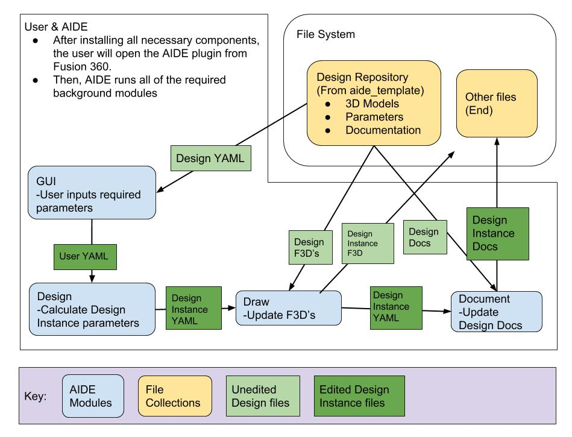
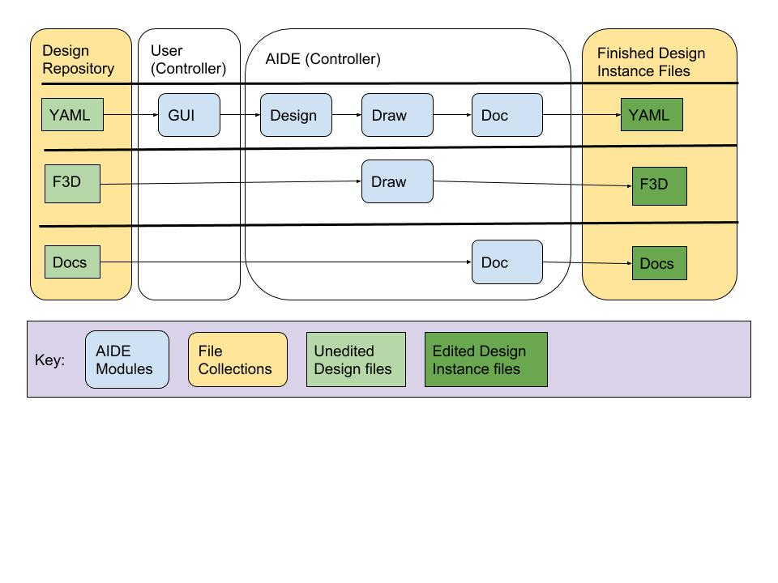
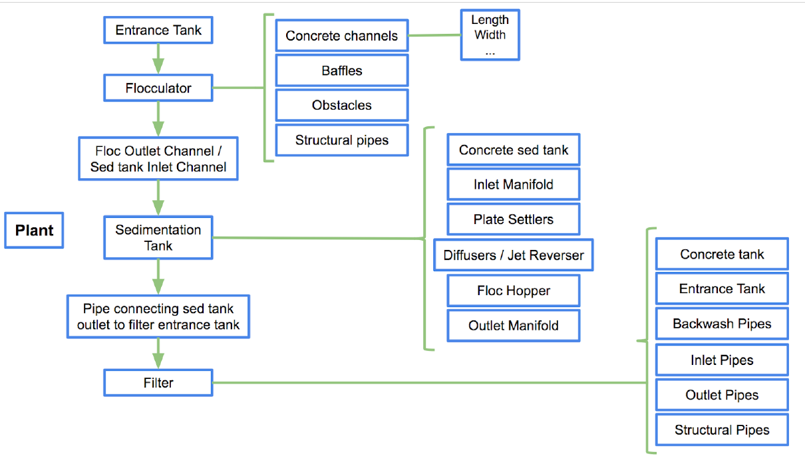
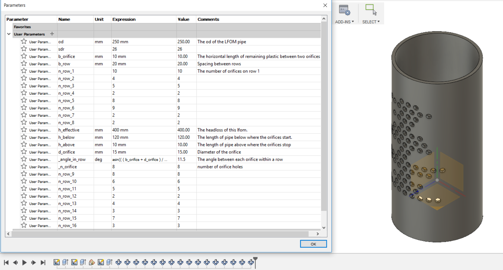

# AIDE - Summer Research Report #1

In this report, quoted lines give a more detailed description of how the components work in the background.
> Skip over them if you only want to read a high-level explanation of the modules.

## AIDE
AIDE is a Fusion 360 add-in that takes in user parameters for flow rate and temperature and produces the hydraulic design and building documentation for a water treatment plant. It utilizes/runs all five of its submodules sequentially, while maintaining separation such that each module can be used on its own to some degree .

### Summary of submodules
1. **Template**: Contains scalable 3D models of water treatment plants and their respective building documentation, maintained by the aide_template team.
2. **GUI** (Graphical User Interface): Displays a user interface in Fusion 360, collects the required input values from the user, and compiles them into a YAML file.
3. **Design**: Runs calculations to form all of the physical parameters of a water treatment plant, based off of the inputs collected by the GUI.
4. **Draw**: Updates and scales 3D models of water treatment plants, based off of the calculated physical parameters from Design.
5. **Document**: Updates and scales building documentation of water treatment plants, based off of the calculated physical parameters from Design.

Here is a chart detailing the flow of information throughout each module:

Here is a chart detailing the flow of information relative to each file:

For an explanation of some of the terms that are used above, see our [ReadMe](https://github.com/AguaClara/aide/blob/master/README.md).

### How AIDE works
In order to use this custom Fusion 360 addin, you must open Fusion 360 > Scripts & Add-Ins > Add-Ins > Green Plus, then select the file location where you have the AIDE folder downloaded/`git clone`'d. Then, select aide > Run.

> Note that before development on AIDE has finished, you will have to also download and move all of the other AIDE modules into this AIDE folder, but assume for now that they are already in AIDE.

The GUI is then opened up for the user.

> In `aide.py`, required dependencies are imported at the top. Then, the `run(context)` function is run, initializing AIDE GUI with `aide_gui.main_run(context, run_design)`. The `run_design` function contains calls to AIDE Design/Draw/Document, and is run by AIDE GUI.

After the user enters their inputs, AIDE Design/Draw/Document are run sequentially, as long as the user has the selected component open in Fusion 360.

> `aide_gui.py` passes `run_design()` as the `on_Success` function and runs it after the user inputs parameters within `MyHTMLEventHandler.notify()`. This function accesses the Fusion 360 UI and loads the the user input YAML and the Design YAML, the latter of which contains the physical parameters for the selected component. Finally, `load_yaml_and_update_params` is called and the component that is being displayed in Fusion 360.

> Note that the current iteration of `aide.py` is incomplete and contains only rudimentary placeholders for `aide_design` and `aide_draw`. Once those two submodules are complete, a full implementation will be developed.

### Progress
#### Module organization
After much discussion, we came to a conclusion of having our AIDE module be the overall controller, separate from the individual submodules of AIDE. This AIDE module will essentially be in charge of running the whole AIDE program and running GUI, Design, Draw, and Document sequentially.

> We did so using a technique known as the [observer pattern](https://en.wikipedia.org/wiki/Observer_pattern), where, instead of passing objects like integers and strings as function parameters, we're able to pass an entire function as a parameter. Then, this "`onSuccess`" function is called whenever it is needed.

## AIDE TEMPLATE

Template utilizes Fusion 360, a CAD software, to create 3D models of the water treatment plant. Fusion is the ideal software for Template because it allows components to be parameterized with equations and numbers. These parameters come from user-defined values and determine the physical dimensions of the plant's components.

### How AIDE Template works

To better understand Template, let's think of a Design template as a burger. Usually when you order a burger, you get a patty, slice of cheese, lettuce, and tomato. The number of each part of the burger can be parametrized as seen below.

Now if you wanted to order a double cheese and double patties, you would input number of patties to equal 2. Within Fusion 360, AIDE and its submodules will take this input and update the parameters for cheese, lettuce and tomato.

 Number of patties = 2 
 
 Number of buns = 2 
 
 Number of cheese slices =   Number of patties 
 
 Number of lettuce slices =  Number of patties 
 
 Number of tomato slices =   Number of patties 

The goal for the summer is to finish the 3D models of all the components and test the assemblies to make sure all the components are linked properly. As parameter values change, the geometry of assemblies should change accordingly without interfering with other assemblies. Furthermore, we are trying to find the best naming convention for Template to use in order to have consistent parameter names throughout AIDE and prevent misunderstanding between subteams.

### AIDE Template Organization of components in Fusion 360

Here is a flowchart describing the flow of water through a water treatment plant's components:

We based the file organization structure off of this flow chart. The folders are
organized hierarchically. There are four main folders that represent the main
assemblies in the water plant. Within each main folder, there is a finalized
components folder and sub-assembly folders are created for sub-assemblies with
the main assembly. In general, these sub-assembly folders contain unfinished
components that aren't ready to be put into the finalized components folder.

  <ul>
    <li>Concrete structures </li>
      <ul>
      <li>Finalized components</li>
      </ul>  
    <li>Flocculator</li>
      <ul>
      <li>Finalized components</li>
      <li>Concrete Channels</li>
      <li>Top Baffles</li>
      <li>Bottom Baffles</li>
      <li>Obstacles</li>
      <li>Structural Pipes</li>
      <li>Plant Entrance Tank</li>
      </ul>
    <li>Filter</li>
      <ul>
      <li>Finalized components</li>
      <li>Filter Control Box</li>
        <ul>
        <li>Hinge Weir</li>
        </ul>
      <li>Concrete Tank</li>
      <li>Entrance Tank</li>
      <li>Pipe Gallery</li>
      </ul>
    <li>Sedimentation tank</li>
      <ul>
      <li>Plate Settler</li>
      <li>Plate Supports</li>
      <li>Tank & Channel</li>
      </ul>  

  </ul>

### Naming Conventions

Currently, the naming convention for parameter names is in the form of:

(sub-assembly)\_(components)\_(parameters)

However, this was not consistently used during the previous semester, and different assemblies or components have inaccurate parameters. The new naming convention we are proposing is that the parameters do not describe which assembly or component they are part of.

Instead of Flocculator  \_ConcreteChannels  \_Length , the parameter will be just called  length.

a_ : angle of ___

n_ : number of ___ (should be unitless)

b_ : distance between ___ (edge to edge)

h_ : vertical height of ___

l_ : length of ___

w_ : width of ___

t_ : thickness of ___

<b> For Naming Pipes </b>

d_ : diameter of

sdr : standard dimensional ratio

od : outer diameter of PIPES

pipe wall thickness = od/sdr

l_pipe : length of pipe

oal_ : overall length

socket_depth : socket depth or how far the pipe can be inserted into the socket

This is a Fusion model of an lfom from the flocculator. As you can see that the parameter names follow the naming convention.

> If you look more carefully, you will see that there is an underscore ( \_ ) in front of some parameter names. Those are called <b>private variables</b>. The underscore in front of the parameter indicates to the AIDE Design that this variable's expression should not be altered. This method will be used for parameters with equations most of the time.

Finally on the right side of the parameter window, you will see the comments section. This is a crucial for communication between team members. The comments describe the use of the parameter since the naming convention will not always be explicitly clear. For instance, n_row_1 may not be clear to other team members, but if you read the comment, it is now clear that n_row_1 is the number of orifices on row 1.

In summary, this summer, AIDE Template will be creating a standardized parameter naming system and implementing it into the models, starting with the flocculator. Hopefully, Template will have a Variable Naming Wiki page like design does by end of this summer. We will also work on organizing files in Fusion. :)

## AIDE GUI
When AIDE is run, it also initializes and runs another Fusion 360 add-in, AIDE GUI (Graphical User Interface). This GUI allows the user to input values (such as desired flow rate) that affect the dimensions of the finished water treatment plant.

### How AIDE GUI works
In order to use AIDE GUI, you must first have AIDE installed and set up, with the AIDE GUI folder within the AIDE folder. You then open Fusion 360 > Scripts & Add-Ins > Add-Ins > aide > Run. The palette window then opens on the right.

> Fusion uses `aide_gui.py` to begin running the palette. At the top are imports for all of the packages that are used and global variables that are referenced when the add-in is run.

> The `main_run(context, onSuccess)` function is then run. After loading global variables and helper functions, the `showPalette` command is defined. This command will be responsible for showing the palette. Normally, this would display a button under one of Fusion's dropdown menus, but we've omitted that functionality. Instead of manually showing the palette with a button, it opens and closes when the add-in is run or stopped.

> The `showPalette` command is then connected to an instance of the `ShowPaletteCommandCreatedHandler` class. Instances of this class, and of all other handler classes within `aide_gui.py`, become "event handlers", similar to event listeners in Java. They "listen" for events being triggered by Fusion 360 - when that happens, they run the `notify(self, args)` function from their respective class.

> This handler is then added to the global `handlers` list so that Fusion can begin listening for the event, and then it is immediately triggered by `showPaletteCmdDef.execute()`.

> In the `ShowPaletteCommandCreatedHandler` class, `notify` is run, which appends a `ShowPaletteCommandExecuteHandler` instance to `handlers` and runs `notify`. The `CreatedHandler` and `ExecuteHandler` work similarly in this regard, but note the difference in the names.

> The `ExecuteHandler` `notify` function is then run. It sets a `command` describing which HTML template and page information to use. This page info is stored in `structure.yaml`, which gives a "sitemap" of the entire GUI. This command is then sent into the `helper.display` function in `helper.py`, which uses Jinja2 to render the page.

> Jinja2 looks through the template HTML (`home.html` in this case) and looks for  or {{ variable names }}, signified by those symbols. It then runs the logic statements to create all of the necessary HTML elements and fills the variable names using the page information stored in `structure.yaml`. The completed HTML is stored in `display.html`.

> The palette is then rendered in Fusion 360 using `display.html` and a `MyHTMLEventHandler` instance is appended to `handlers` to begin listening for clicks.

You can then click on the blue buttons and the dropdown menu to navigate throughout the GUI.

> Every HTML template extends `base.html`, which contains:
> 1. Access calls to Bootstrap scripts that make them look nice
> 2. Render instructions for our dropdown menu
> 3. A `<script>` element containing all of our Javascript functions.

> Every `<button>` element in the HTML templates maps to the `sendInfoToFusion` Javascript function defined in `base.html`. This function gathers the same data from `structure.yaml` for the next page to be loaded and passes it to `aide_gui.py` to be used. This data is stored hierarchically, meaning that each subsequent page is one level "deeper".

> This passed data is collected in `MyHTMLEventHandler.notify`, where it renders the next page and refreshes `display.html` the same way as in `ExecuteHandler.notify`.

If you go to Designs > Load Design, you're then brought to the user inputs page, where you can give parameters that are necessary for generating the design that you selected.

> In `template.html`, there is a `<form>` element with a set `id` that contains all of the `<input>` elements defined in `structure.yaml` under the `params` keys. After user values are entered and "Collect" is clicked, a slightly different `sendInfoToFusion` call is made where these `<input>` elements' values are collected with `formToDict()`. These collected values are then sent to `MyHTMLEventHandler.notify` and written to `params.yaml`.

### Progress
#### File reorganization
We started out by restructuring the files in the top-most directory to contain the following:
1. `aide_gui.py` and `helper.py` have the code to run the Fusion 360 add-in.
2. `data/` contains the files necessary for displaying the GUI:
    1. `display.html` shows the current page in the GUI when it's being used.
    2. `structure.yaml` gives a "sitemap" of all the pages in the GUI and what data they show.
    3. `templates/` contains the default HTML templates which are combined with the data in `structure.yaml` to display specific pages.
        - `base.html` contains Javascript script that sends button presses in `display.html` to `aide_gui.py`.
    4. `images/` contains pictures that are displayed in the palette.
3. `dependencies/` contains the Python packages for displaying the GUI and processing user inputs:
    - `jinja2`, `markupsafe`, `urllib3`, `yaml`

#### Added functionality
We now have the ability to output a YAML (`params.yaml` in the top level directory) containing the user's inputs for a given design. This is the YAML that will be passed on to the design team to do the calculations.
> To do this, we added the `formToDict` function in `base.html`'s JavaScript that collects inputs within a HTML `<form>` object in `template.html`.

## AIDE Design
Design runs hydraulic calculations based off of inputs from GUI, creating exact physical dimensions for each component.

### How AIDE Design works
Within the `aide_design` package, there are three main folders of code:
1. `designs\`: Contains Python *classes* for each component. When a component's class is initialized, it contains all of that component's physical dimensions as parameters.
2. `functions\`: Contains Python *functions* for each component. Note that these functions are used independently for calculating individual physical parameters - they are *not* supposed to be used as instantiated objects.
3. `shared\`: Contains various *functions* for general physical calculations, used across `aide_design`

In the current iteration of AIDE, we are first testing the creation of a LFOM design through all modules. Although currently incomplete and not up to date, we would use the `lfom.py` within `designs/` to instantiate an LFOM object describing all of the necessary dimensions.

> Right now, we are working as if `aide_design` was completed and running. In the run function in aide, we have written in a function that is replacing the design functions for now. In `lfom.yaml`, for the time being, we are only calculating one small thing, the spacing. After the YAML is changed with the new calculation, this YAML is then passed to AIDE Draw.

## AIDE Draw
After the YAML is passed from Design, Draw uses the final parameters and update a parameterized Fusion 360 design.

## How AIDE Draw works
This is done by taking a YAML template file which specifies parameters for the Fusion design, reading those parameters and applying the changes to their corresponding values in Fusion 360 assemblies.

## Progress
The first thing that was done in the summer with aide_draw was get rid of any files and folders that we believed were not necessary. We still have yet to do a deep dive into the code and refactor any necessary functions, as well as change up the naming conventions to make it easier to develop on.

## AIDE Document
Using the specified physical parameters and documentation templates, Document generates completed build documentation for the hydraulic design of a water treatment plant.

### How AIDE Document works
`aide_document` is distributed via a PIP package, which can be installed on your computer by running `pip install aide_document`. There are a collection of functions in submodules that can then be accessed by a call of `module.function`:
1. `combine`: Contains a function to combine YAML's with documentation templates via Jinja2.
    - `render_document()`: Takes in a YAML and a Markdown template and combines the two, putting the result in a specified file location.
2. `convert`: Converts the output Markdown file to a PDF.
    - `md_to_pdf()`: Converts a specified Markdown file to a PDF file.
3. `translate`: Translates a Markdown file to a different language using the Google Translate API.
    - `translate()`: Translates Markdown between two different languages. Has the option of specifying special words to ignore the Google Translate translation and use your own translation.

Thanks for reading! :D
